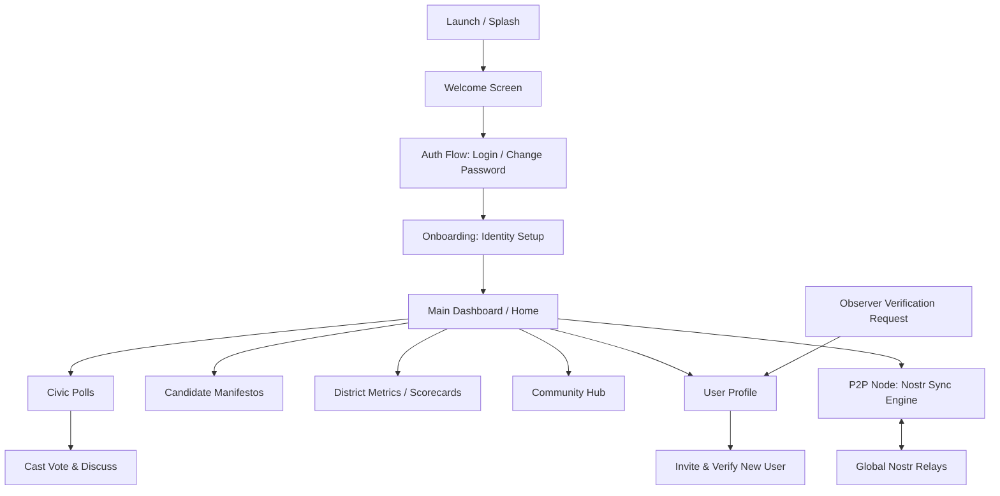

# PROJECT MASTER FILE - WeTheGoverned (Android & Desktop)

**Project Name:** WeTheGoverned (WETHEGOVERNED)
**Package Name:** net.wetheGoverned
**Last Updated:** <!-- DATE_START -->2026-08-08<!-- DATE_END -->
**Target SDK / Compile SDK:** 35
**Min SDK:** 24
**Architecture:** MVVM / Clean Architecture / Multiplatform (KMP)

## 1. Project Overview
- **Type:** Kotlin Multiplatform (Android + Desktop + iOS + Web/Wasm)
- **Main Purpose:** A decentralized civic platform designed to empower citizens through participating in district-level polls, tracking representative performance (Scorecards), and managing a localized network of trust. It uses the Nostr protocol for decentralized identity and P2P data synchronization.
- **Key Features:**
    - **Decentralized Identity:** Uses Secp256k1 keypairs (Nostr) for user identity. Supports `nsec` login for cross-platform global identity.
    - **Verified Network of Trust:** Invitation-only registration system where verified users can vouch for and add new residents. 
    - **Civic Governance:** Multi-level polling (Federal, State, District, Local) with real-time result aggregation.
    - **Bulletproof P2P Sync:** Real-time data synchronization using a 12-relay governance pool. Features BIP-340 Schnorr signatures, SHA-256 deterministic IDs, and protocol-compliant event broadcasting.
    - **Mesh Gossip & Self-Healing:** Clients dynamically discover working relays via NIP-65/66 and share a "Shared Master List" of healthy nodes with other peers.
    - **Automatic Failover:** Resilient relay management that rotates to healthy nodes if a connection is dropped or blocked.
    - **Community Hub:** Integrated board for marketplace posts, jobs, and community announcements.
- **Tech Stack:**
    - **Language:** Kotlin 2.0.21
    - **UI:** Jetpack Compose Multiplatform (Centered layout, X-style aesthetic)
    - **Networking:** Ktor 3.0.0-rc-1 (WebSockets)
    - **Cryptography:** Custom BIP-340 Schnorr Signer (Pure Kotlin for Wasm/JVM compatibility)
    - **Storage:** Room (Planned), LocalStorage (Web), Preferences (Desktop)

## 2. High-Level App Workflow


**Detailed Workflow Steps:**
1. **Welcome/Auth:** Users enter through a Welcome screen. Login requires a pre-created geographical username.
2. **First Login:** Users with temporary passwords (`temp_` prefix) are prompted to use the **Change Password** flow.
3. **Identity Setup:** Onboarding generates or imports Nostr keys (nsec/npub). No address/MFA check required for initial access.
4. **Dashboard:** Home displays active polls and navigation to key features. Layout is centered and unified across Desktop and Web.
5. **Network Expansion:** Verified users access a "Register New User" screen from their profile to manually add residents using name, address, and district info. Observers can use the "Find a Verifier" feature to submit their details to local verified users.
6. **Data Sync:** All votes, polls, and profiles are synced via `P2PSyncEngine`. Upon login, clients upload local polls to the relays to ensure all instances are updated.

## 3. Project Structure
<!-- STRUCTURE_START -->
```text
WETHEGOVERNED/
├── app/                        # Android-specific module
│   └── src/main/java/net/wetheGoverned/
│       ├── data/               # Android Data implementations (Firestore/Auth)
│       └── ui/screen/          # Android UI (Screen components)
├── shared/                     # Multiplatform Logic & UI
│   ├── src/commonMain/kotlin/net/wetheGoverned/
│   │   ├── core/               # Key Management (Secp256k1), Utilities
│   │   ├── data/               # P2P Sync Engine, Nostr Relay Manager
│   │   ├── model/              # CivicModels, UserAccount, Polls
│   │   ├── repository/         # Repository Interfaces
│   │   ├── session/            # SessionManager, UserSession
│   │   └── ui/                 # Shared Composables & ViewModels
│   ├── src/androidMain/        # Android-specific UI & Location Helper
│   ├── src/iosMain/            # iOS-specific UI (MainViewController)
│   ├── src/desktopMain/        # Desktop-specific UI & Repository implementations
│   └── src/wasmJsMain/         # Web-specific (Wasm) entry & LocalStorage Repositories
├── iosApp/                     # iOS Application (Xcode project & Pods)
├── docs/                       # Web distribution (GitHub Pages deployment)
├── gradle/                     # Gradle Wrapper & Version Config
├── PROJECT_MASTER.md           # This Context File
└── build.gradle.kts            # Root Build Config
```
<!-- STRUCTURE_END -->

## 4. Core Architecture & Patterns
- **Architecture pattern used:** MVVM (Model-View-ViewModel) with a shared UI layer in Compose.
- **Dependency Injection:** Hilt (Android), Manual DI / Factory pattern (Shared/Desktop/Web).
- **Navigation:** Jetpack Compose Navigation (Shared routes in `App.kt`).
- **UI Layer:** 100% Jetpack Compose Multiplatform. Shared "X-style" aesthetic (Dim grey, Tertiary Blue).
- **Data Layer:** Repository pattern with separate implementations for Desktop (Preferences), Android (Room), and Web (LocalStorage).
- **Key Design Patterns:** Observer (StateFlow), Singleton (RelayManager), Strategy (Platform-specific Repositories).

## 5. Important Packages & Their Responsibilities
| Package | Responsibility | Key Classes |
| :--- | :--- | :--- |
| `net.wetheGoverned.ui` | Main UI Screens & Shared ViewModels | `AuthViewModel`, `HomeViewModel`, `PollDetailViewModel` |
| `net.wetheGoverned.model` | Core data structures for the civic domain | `CivicPoll`, `ResidentProfile`, `CivicEvent` |
| `net.wetheGoverned.repository`| Data access abstraction | `ResidentRepository`, `PollRepository`, `WebPollRepository` |
| `net.wetheGoverned.data` | Synchronization and API layers | `P2PSyncEngine`, `NostrRelayManager`, `WsCivicPublisher` |
| `net.wetheGoverned.session` | User session lifecycle & persistence | `SessionManager`, `UserSession`, `WebSessionStorage` |
| `net.wetheGoverned.core` | Cryptography and core utilities | `PlatformUtils`, `CivicPublisher` |

## 6. Key Files & Entry Points
| File | Purpose | Importance |
| :--- | :--- | :--- |
| `App.kt` | Main Navigation Host & Shared UI Entry | ★★★★★ |
| `Main.kt` (Web) | Web distribution entry point (Wasm) | ★★★★★ |
| `Main.kt` (Desktop) | Desktop application entry and Node initialization | ★★★★★ |
| `P2PSyncEngine.kt` | Manages Nostr subscriptions, cross-device sync, and uploads | ★★★★★ |
| `WsCivicPublisher.kt` | Formats and signs events for Nostr protocol compliance | ★★★★★ |
| `HomeViewModel.kt` | Dashboard logic, dynamic stats, and district selection | ★★★★★ |
| `DesktopRepositories.kt` | Persistence logic for the desktop version | ★★★★ |
| `WebRepositories.kt` | Persistence logic for the web version (LocalStorage) | ★★★★ |

## 7. Data Flow & State Management
- **Flow:** `P2PSyncEngine` (incoming event) → `Repository` (sync/save) → `ViewModel` (observe Flow) → `UI` (collectAsState).
- **UI Interaction:** `UI` (event) → `ViewModel` (action) → `Repository` (save/send) → `P2PSyncEngine` (publish to Nostr).
- **Cross-Device Sync:** `POLL_VOTE` from device A → Nostr Relay → device B `P2PSyncEngine` → `markVoted` in Local Repository.

## 8. Important Modules / Features
- **Shared Module:** Contains 90% of the code, including UI, models, and business logic.
- **Web Node:** Deployed via GitHub Pages from the `/docs` folder on `web-wasm` branch.
- **Sync Architecture:** Unified hashing and signing ensures all platform-created events are valid NIP-01 Nostr events stored on public relays.

## 9. Build & Configuration
<!-- BUILD_CONFIG_START -->
- **Gradle Version:** 8.13
- **Kotlin Version:** 2.0.21
- **AGP Version:** 8.13.2
- **Key Dependencies:** Ktor (Networking), Compose Multiplatform (1.7.0), kotlinx-serialization, kotlinx-datetime.
- **Compatibility:** iOS targets (iosX64, iosArm64, iosSimulatorArm64) configured via CocoaPods.
- **Platform Specifics:** JVM-only dependencies (Ktor Server, Web3j) isolated to `androidMain` and `desktopMain`.
<!-- BUILD_CONFIG_END -->

## 10. Coding Standards & Conventions
- **Naming:** CamelCase for classes, camelCase for functions/variables. ViewModel state ends in `UiState`.
- **Error Handling:** Result monad used for repository and API calls.
- **State:** Reactive `SessionManager` provides a `session` StateFlow for automatic sync engine re-subscription.

## 11. Future Roadmap & TODOs
- [x] Implement Nostr NIP-01 event signing and ID hashing for sync.
- [x] Implement real BIP-340 Schnorr signatures for public relay acceptance.
- [x] Add dynamic relay discovery (NIP-65/66) and mesh gossip.
- [x] Unified Web and PC aesthetic and layout centering.
- [x] Real-time state mirroring for votes and rankings.
- [ ] Add Room database for shared persistence (KMP).
- [ ] Enhance SQLDelight integration for complex poll aggregation.
- [ ] Implement local mesh discovery (mDNS/Bluetooth) via `MeshDiscoveryManager`.
- [ ] Add encrypted DMs (NIP-04) for verifier-to-resident communication.
